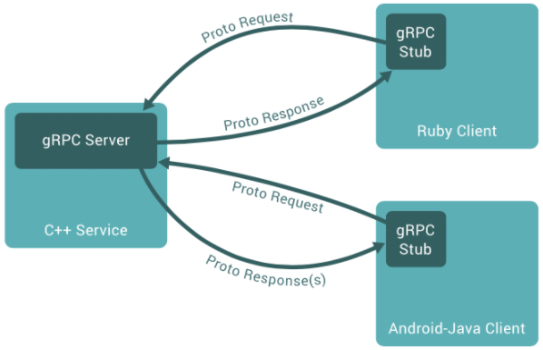

# gRPC

- gRPC: 구글에서 개발한 오픈소스 RPC(Remote Procedure Call) 시스템

### RPC(Remote Procedure Call) : 원격 프로시저 호출

- client-server 모델을 사용
- 클라이언트에서 서비스를 요청(function call)하면, 서버에서 서비스를 제공.
- 한 프로그램이 네트워크의 세부 정보를 이해하지 않고도 네트워크 안의 다른 컴퓨터에 있는 프로그램에서 서비스를 요청하는 프로토콜
- [verbose explanation](https://users.cs.cf.ac.uk/Dave.Marshall/C/node33.html)

### gRPC의 기본

- 전송을 위해 TCP/IP 프로토콜과 HTTP 2.0 프로토콜을 사용하여 성능이 뛰어남
- Protocol Buffer를 IDL로 사용 (proto3가 최신버전)
- SSL/TLS를 사용하여 서버를 인증하고, 클라이언트와 서버간에 교환되는 모든 데이터를 암호화
- C#, C++, Dart, Go, Java, Kotlin, Node, Objective-C, PHP, Python, Ruby 지원

### 기본 구조

- 기본 취지: 클라이언트에서 서버가 같은 머신에 존재하는 것처럼 사용할 수 있도록 디자인됨.

- 때문에 MSA 구현하기 용이함.

  - 복수의 백엔드 어플리케이션들을 gRPC 입장에서 서버와 클라이언트로 구분할 경우,
  - 서버: 서버 인터페이스를 구현하고 gRPC 서버를 실행하여 클라이언트 호출을 처리하는 역할.
  - 클라이언트: 서버의 서비스들을 함수 호출하듯이 사용 가능. 클라이언트 내 gRPC Stub의 메서드를 invoke시키면 자동으로 서버에 Proto Request을 보내고 Response를 받아오는 역할.

- cf) (method) stub : piece of code used to stand in for some other programming functionality

### gRPC 구현 : Protocol Buffer

- Any custom data type that needs to be serialized will be defined as a Protocol Buffer in gRPC.
- 작성된 Protocol Buffer가 특정 프로그래밍 언어로 컴파일되면 자동으로 각 필드 정의에 대해 게터/세터가 제공됨

1. Create the service definition and payload structure in the Protocol Buffer (.proto) file.
2. Generate the gRPC code from the .proto file.
3. Implement the server in one of the supported languages.
4. Create the client that invokes the service through the Stub.
5. Run the server and client(s).

## 참고자료

- [gRPC 설명 및 실습](https://thenewstack.io/grpc-lean-mean-communication-protocol-microservices/)
- [gRPC 공식문서](https://grpc.io/)
- [한국어 블로그 글](https://chacha95.github.io/2020-06-15-gRPC1/)
- [gRPC vs REST](https://blog.dreamfactory.com/grpc-vs-rest-how-does-grpc-compare-with-traditional-rest-apis/0)
