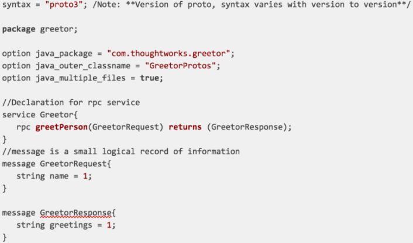

# IDL(Interface Description language)

- IDL : 프로그램 간 통신할 때 주고받는 정보의 `형식`에 대한 규칙
  - 특징: `describe an interface in a language-independent way`, 즉 서로 다른 프로그래밍 언어를 사용하는 소프트웨어 간의 소통을 가능하게 해줌
- (비교) 프로토콜 : 서버와 클라이언트가 정보를 `주고 받는` 규칙

### XML(eXtensible Markup Langauge)

- 특정 데이터를 설명하기 위해 이름을 임의로 지은 태그로 데이터를 감싸는 구조.
- 태그를 활용하여 사용자가 직접 데이터 구조를 정의 가능.
- HTML과 유사한 형식. HTML처럼 사용자에게 데이터를 보여주는 것이 목적이 아닌, 데이터를 저장하고 전달할 목적으로 만들어진 것으 XML
- SOAP, WSDL 표준: HTTP + XML 조합을 통한 원격 통신. 너무 제한적이라는 단점.
- cf) YAML(YAML Ain't Markup Language) : YAML is a human friendly data serialization language for all programming languages.

### JSON(JavaScript Object Notation)

- Javascript의 부상으로 많이 쓰이고 있는 데이터 구조
- XML이 지닌 낮은 가독성 & 느린 속도 등의 문제를 해결함
- key-value로 정의된 구조 활용
- REST 표준: HTTP + JSON 조합. 현대 개발자들에게 있어 표준

### Protocol buffers(proto)

- Protocol buffers : 구조화(structured)된 데이터를 직렬화(serialization)하기 위한 프로토콜.
- proto2보다 proto3 버전 사용이 권장됨.

- Proto는 XML과 JSON보다 다양한 측면에서 장점을 지님

  - 파일 크기: 3배 ~ 10배 정도 작음
  - 속도 비교: XML < JSON < Proto. (XML보다 20배~ 100배 정도 빠름)
  - 가독성이 좋고 명시적
  - 크기가 매우 큰 데이터를 전송할 때 비용이 덜 발생함
  - 데이터 보안 측면에서 스키마 정보가 없다면 외부자가 decode 불가
  - 키워드만으로 validation 가능

- Proto만의 특성(XML, JSON과의 차이)
  - RPC의 인터페이스로 사용 가능
  - 브라우저에서는 이해 불가
  - Javascript 지원되지 않음
  - Not Human Readable Data

- XML 스키마처럼 .proto 파일에 protocol buffer 메세지 타입을 정의
- service에서 rpc 서비스명, 매개변수형, 반환형 지정
- message는 매개변수형과 반환형에 대한 타입 정보 지정

### GrapQL Schema Definition

- GraphQL은 고유한 gql 문법 구조를 사용함.
- GraphQL 스키마는 IDL (Interface Definition Language) 혹은 SDL (Schema Definition Language)로 분류됨.
