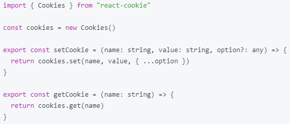
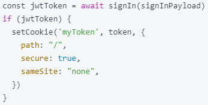
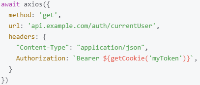

# 쿠키

- 쿠키: 각 브라우저에서 관리되는 사용자 관련 데이터
- 계정 인증 외에도 언어 설정 정보 등을 브라우저에 저장할 때 사용.
- 기본적으로 세션과는 별개의 개념
- 쿠키는 웹 브라우저에만 있는 개념.

### 특징

- name-value 쌍의 형식으로 브라우저에 데이터를 저장.
- 도메인에 한정됨. 특정 사이트에서 받은 쿠키는 해당 사이트에서만 사용됨.
- 유효기간 지정 가능.

### 과정

1. 서버는 특정 요청에 대한 응답 속에 브라우저에 쿠키로 저장해놓을 정보를 포함시켜놓을 수 있음.

2. 브라우저에서 react-cookie로 해당 쿠키를 저장하고 읽을 수 있음. 옵션을 통해 유효기간 지정 가능.

   

3. 서버로부터 돌아온 요청에 담겨 있는 토큰을 값으로 하는 쿠키를 저장.

   

4. 해당 사이트에 다시 접근할 때 브라우저는 저장된 쿠키의 값을 Authorization 헤더에 포함시켜서 서버로 요청을 보냄.

   

=> 이를 통해 재로그인 과정 생략, 지정해놓은 언어 설정 그대로 사용하는 등의 이점 존재.
